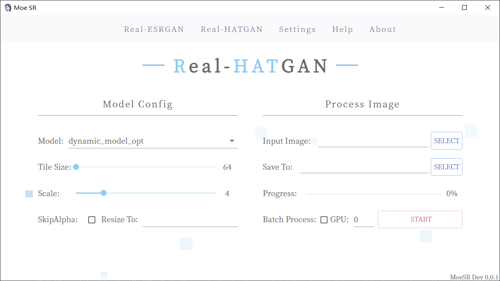

# MoeSR

## 关于

MoeSR是一个专注于插画/Galgame CG等ACGN领域的图像超分辨率的应用，基于Python，Eel，Electron，React开发。

开发此项目原因：

1. 现有超分模型效果个人不太满意，故尝试自己训练更好的模型
2. 想做个简约风格的GUI，以及一些自定义功能，同时为了能加载上面的模型。
3. 为游戏或者其他作品高清重置提供更好的效果？

如果遇到BUG，有期望的功能可以提Issue，有精力的情况下会修复和考虑新增功能。（此项目为个人项目，直接使用中文交流即可）

软件截图：

## 如何使用

1. 从旁边的Release处下载压缩包，解压后打开`启动.bat`即可，无需安装依赖。
2. 软件导航栏上有帮助(Help)，可点击查看更详细的说明。

### 模型比较

当前版本为预览版本，以下除RealESRGAN官方模型外为本项目自行训练的模型，更新可能略晚于软件本体，所以暂未实装进软件，我需要详细测试以得到更好的效果，请耐心等待。

  | 模型名称                                | 描述                                                         |
   | --------------------------------------- | ------------------------------------------------------------ |
   | Real-ESRGAN-x4: Anime6B-Official        | RealESRGAN官方提供的动画插画模型                             |
   | Real-ESRGAN-x4: jp_Illustration-fix1    | 适用于日系插画，一般修复强度（去模糊，JPEG还原），模型适当自由发挥 |
   | Real-ESRGAN-x4: jp_Illustration-fix1-d  | 适用于日系插画，一般修复强度，保留更多细节                   |
   | Real-HATGAN-x4: jp_Illustration-fix1    | 适用于日系插画，一般修复强度                                 |
   | Real-HATGAN-x4: jp_Illustration-fix2    | 适用于日系插画，更多的修复，少量丢失细节                     |
   | Real-HATGAN-x2: universal-fix1          | 适用于各种风格的2d插画，一般修复强度                         |
   | Real-HATGAN-x1: jp_Illustration-fixonly | 适用于日系插画，仅修复图片，不进行放大                       |
   | Real-HATGAN-x2: jp_Illustration-fix1    | 适用于日系插画，一般修复强度                                 |

## 开源协议外的附加条款

1. 请尊重劳动成果，禁止以任何形式贩卖本软件以及其中的模型
2. 在用户不知道此软件能免费使用的情况下使用本软件及模型提供付费超分辨率服务
3. 软件为开源项目且在本地运行，发布后开发者无法管理。用户使用产生的任何纠纷/法律问题自行解决，与开发者无关。

## 支持本项目

如果你觉得此项目不错，能帮助到你，可以给一个Star。

如果想为本项目发电可到：https://afdian.net/a/luo_yi

注意事项：发电为无偿赞助，不赞助仍可使用到软件的**全部功能**，对于赞助者作者只能感谢你，而没法为你提供定制功能，疑难解答等任何服务。

## 技术相关

### 数据集

27W张图片（约740GB）

通过ResNet50进行分类（日系插画，其他插画，漫画，文本信息，噪点等）

分类准确率为92%左右

### 超分辨率模型训练

此项目首先采用的是Real-ESRGAN，但默认配置训练下来效果和官方已有模型差不多。经过20次左右实验，配合新的损失函数，得到了还行的效果。同时将这套方案拿到HAT上训练，也得到不错的效果（可惜HAT加入新的损失函数没有提升太多）。

最终优化方案简述：

1. 图片降质方案修改为仅退化一次，移除高斯噪声和泊松噪声
2. 加入边缘损失引导模型注重边缘（Canny，Sobel，ColorSobel）

详细的训练指南/踩坑与试验记录见：`doc/TrainNote.md`

修改后的训练代码与新增的损失函数将于最近整理上传。

### 推理框架选择

开始用的ncnn，因为它很轻量+计算快还有FP16体验不错，但后面都写好了ESRGAN的推理代码，然后发现HAT用不了，具体原因为不支持４维以上矩阵计算（以后会不会支持不清楚），而HAT中最高有6维，已尝试将高维计算自行实现并注册为自定义层，然后修改模型图替换为自定义层，但后面又出了问题，一些算子在转换时有错误，比如线性层。（折腾了4天没搞成）

最后还是选了Onnx,虽然缺点是无法获得GPU名称与ID的映射，用户体验会差一点，另外onnx fp16测试下来误差较大，最后未采用。

## 开发&构建

Todo...

## 参考与引用

超分辨率算法：

- Real-ESRGAN: https://github.com/xinntao/Real-ESRGAN
- HAT: Hybrid Attention Transformer for Image Restoration: https://github.com/XPixelGroup/HAT

其他：

- Eel: https://github.com/python-eel/Eel

- 默认图标来自： 《ハミダシクリエイティブ》中的角色 "錦 あすみ"

- UI 美术风格参考：

  『アインシュタインより愛を込めて』オフィシャルウェブサイト：https://glovety.product.co.jp/

